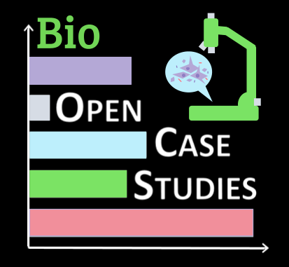

```{r, warning=FALSE, echo=FALSE}
if (!requireNamespace("reactable", quietly = TRUE)) {
  install.packages("reactable", dependencies = TRUE, repos = "http://cran.rstudio.com/")
}
```


```{css, echo=FALSE}
.bioocs-btn {
  display: inline-block;
  padding: 14px 32px;
  background: white;
  color: #1a7a4a;
  text-decoration: none;
  border-radius: 8px;
  font-weight: 600;
  font-size: 1.05rem;
  transition: transform 0.2s, box-shadow 0.2s;
  margin: 6px;
}
.bioocs-btn:hover {
  transform: translateY(-3px);
  box-shadow: 0 4px 14px rgba(0,0,0,0.25);
  color: #1a7a4a;
  text-decoration: none;
}
.bioocs-btn.disabled {
  opacity: 0.55;
  cursor: not-allowed;
  pointer-events: none;
}
.features-grid {
  display: grid;
  grid-template-columns: repeat(auto-fit, minmax(220px, 1fr));
  gap: 24px;
  margin: 32px 0;
}
.feature-card {
  background: #f9f9f9;
  border-radius: 8px;
  padding: 28px 24px;
  border-left: 4px solid #1a7a4a;
}
.feature-card h3 {
  font-size: 1.15rem;
  font-weight: 600;
  color: #1a7a4a;
  margin: 0 0 10px 0;
}
.feature-card p {
  color: #555;
  font-size: 0.97rem;
  line-height: 1.6;
  margin: 0;
}
.coming-soon-box {
  background: #f0f7f4;
  border: 1.5px dashed #1a7a4a;
  border-radius: 8px;
  padding: 4px 32px;
  text-align: center;
  color: #555;
  margin: 1px 0;
}
.coming-soon-box h3 {
  color: #1a7a4a;
  font-size: 1.4rem;
  margin: 10px 0 10px 0 !important;
  padding-top: 0 !important;
}
```




## About BioOCS

BioOCS is an extension of the [Open Case Studies](https://opencasestudies.org/) project focused on the biomedical sciences. BioOCS is designed for learners in biology, biomedical research, and quantitative biology.

## Incoming Case Studies {#case-studies}

```{r incoming-table, echo=FALSE, message=FALSE, warning=FALSE}
library(reactable)
library(dplyr)

incoming <- tibble::tribble(
  ~Title, ~`Bioinformatics Topics`, ~`Biological Topics`, ~`Data Types`,
  "Analyzing Single-Nucleus RNA Sequencing Data from Control and Sleep-Deprived Mice",
    "Single-nucleus RNA sequencing analysis, Normalization",
    "Sleep Deprivation",
    "snRNA-seq (single-nucleus RNA-seq)",
  "Predicting age based on epigenetic markers (epigenetic clock) using Neural Networks in R with scorcher",
    "Deep Learning, AI, Neural Networks",
    "Epigenetic Clocks, Aging",
    "Methylation Data",
  "Analyzing Spatially-Informed Gene Expression to Compare Schizophrenia and Neurotypical Cases Using an Image-Based Approach",
    "Image-based Spatial Transcriptomics, Gene Expression Analysis",
    "Schizophrenia",
    "Xenium spatial transcriptomics data",
  "Revealing Hidden Patterns of Interferon Responses in Individual Cells Using CoGAPS",
    "Latent variable analysis, Dimension reduction techniques",
    "Interferon responses",
    "scRNA-seq (single-cell RNA-seq)",
  "Discovering Temporal Gene Expression Patterns with CoGAPS in Single-Cell Influenza Infection Data",
    "Temporal Analysis, Latent variable analysis, Dimension reduction techniques",
    "Influenza infection",
    "scRNA-seq (single-cell RNA-seq)",
  "Using containers for reproducible analyses",
    "Docker, Containers",
    "Metabolomics",
    "Study Information",
  "Using GitHub for version controlled reproducible analyses: Exploring Maternal and Infant Microbiome Metadata",
    "GitHub, Metadata",
    "Maternal and infant microbiome",
    "Metadata"
)

reactable(
  incoming,
  searchable  = TRUE,
  pagination  = FALSE,
  striped     = TRUE,
  highlight   = TRUE,
  bordered    = TRUE,
  defaultColDef = colDef(minWidth = 120),
  columns = list(
    Title = colDef(minWidth = 220, style = list(fontWeight = "500")),
    `Bioinformatics Topics` = colDef(minWidth = 180),
    `Biological Topics`     = colDef(minWidth = 140),
    `Data Types`            = colDef(minWidth = 160)
  ),
  theme = reactableTheme(
    headerStyle  = list(background = "#1a7a4a", color = "#fff", fontWeight = "500"),
    stripedColor = "#f0f7f4",
    highlightColor = "#d6ede5",
    borderColor  = "#dde",
    style        = list(fontSize = "1.4rem")
  )
)
```

<div class="coming-soon-box">
<h3>Coming Soon</h3>
<p>BioOCS case studies are currently in development. Check back for updates as new case studies are released.</p>
</div>

