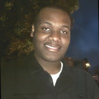

```{r setup, include=FALSE}
knitr::opts_chunk$set(echo = FALSE)
```

<style>
.profile-container {
  max-width: 1200px;
  margin: 60px auto;
  padding: 0 40px;
}
.profile-layout {
  display: grid;
  grid-template-columns: 400px 1fr;
  gap: 80px;
  align-items: start;
}
.profile-left { text-align: center; }
.profile-avatar {
  width: 280px;
  height: 280px;
  border-radius: 50%;
  object-fit: cover;
  margin: 0 auto 30px auto;
  display: block;
}
.profile-name {
  font-size: 2.5rem;
  font-weight: 400;
  color: #333;
  margin: 0 0 12px 0;
  line-height: 1.2;
}
.profile-role {
  font-size: 1.1rem;
  color: #888;
  font-weight: 300;
  margin: 0 0 10px 0;
}
.profile-org {
  font-size: 1.5rem;
  margin: 0 0 30px 0;
}
.profile-org a { color: #1e90ff; text-decoration: none; }
.profile-org a:hover { text-decoration: underline; }
.social-links-large {
  display: flex;
  justify-content: center;
  gap: 16px;
  margin-top: 24px;
  flex-wrap: wrap;
}
.social-links-large a {
  color: #1e90ff;
  transition: transform 0.2s, color 0.2s;
  text-decoration: none;
  display: inline-flex;
  align-items: center;
}
.social-links-large a svg { fill: #1e90ff; }
.social-links-large a:hover { transform: scale(1.15); color: #0066cc; }
.social-links-large a:hover svg { fill: #0066cc; }
.profile-right { padding-top: 40px; }
.bio-section p {
  font-size: 2rem;
  line-height: 1.8;
  color: #333;
  margin-bottom: 16px;
}
.education-section { margin-top: 50px; }
.education-section h2 {
  font-size: 2rem;
  font-weight: 400;
  color: #333;
  margin: 0 0 30px 0;
}
.education-item {
  margin: 0 0 30px 0;
  display: flex;
  gap: 20px;
  align-items: flex-start;
}
.education-icon { font-size: 2rem; color: #333; margin-top: 5px; }
.education-content { flex: 1; }
.education-degree {
  font-weight: 600;
  color: #333;
  font-size: 1.7rem;
  margin-bottom: 4px;
}
.education-institution { color: #666; margin-bottom: 2px; }
@media (max-width: 900px) {
  .profile-layout { grid-template-columns: 1fr; gap: 40px; }
  .profile-right { padding-top: 0; }
}
.back-button {
  position: fixed;
  top: 40px;
  right: 60px;
  z-index: 999;
  padding: 10px 20px;
  background-color: transparent;
  color: #333;
  border: 2px solid #333;
  border-radius: 4px;
  font-size: 1.5rem;
  cursor: pointer;
  text-decoration: none;
  transition: background-color 0.2s, color 0.2s;
}
.back-button:hover {
  background-color: #333;
  color: white;
}
</style>

<div class="profile-container">
<a href="../../team.html" class="back-button">← Back to Team</a>
<div class="profile-layout">

<div class="profile-left">

<h1 class="profile-name">Oshane Thomas</h1>
<div class="profile-org"><a href="https://www.fredhutch.org">Fred Hutchinson Cancer Center</a></div>
<div class="social-links-large">
</div>
</div>

<div class="profile-right">
<div class="bio-section">
</div>

<div class="education-section">
</div>
</div>

</div>
</div>
